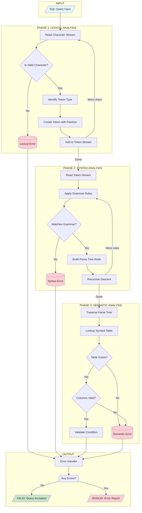
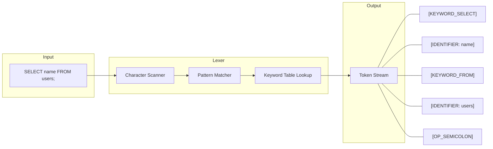
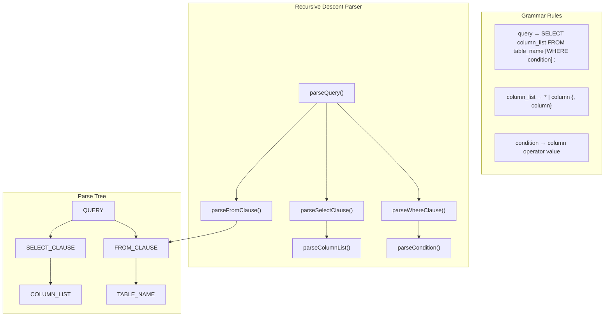
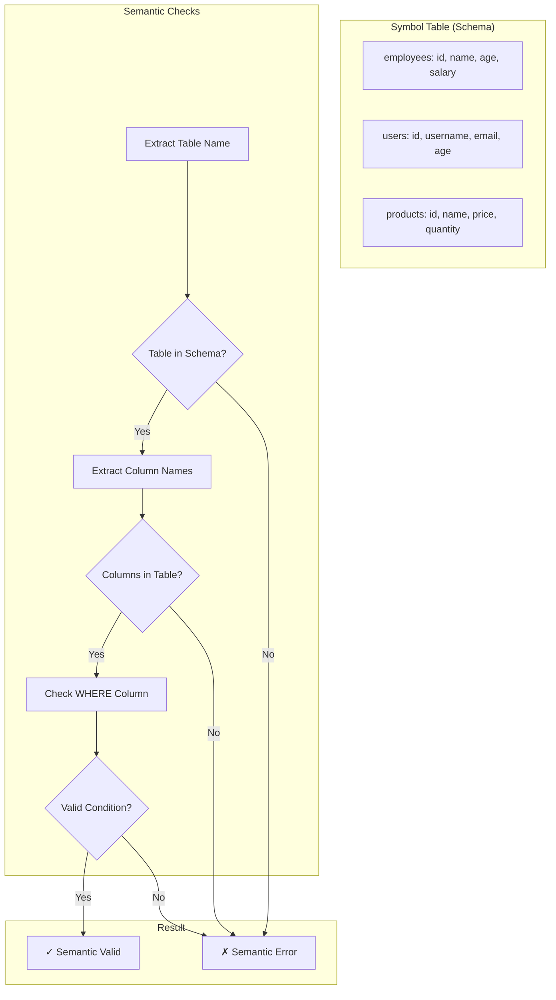
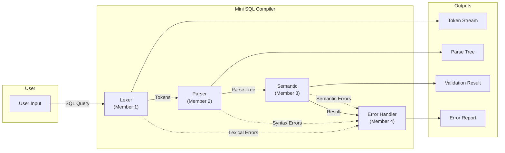
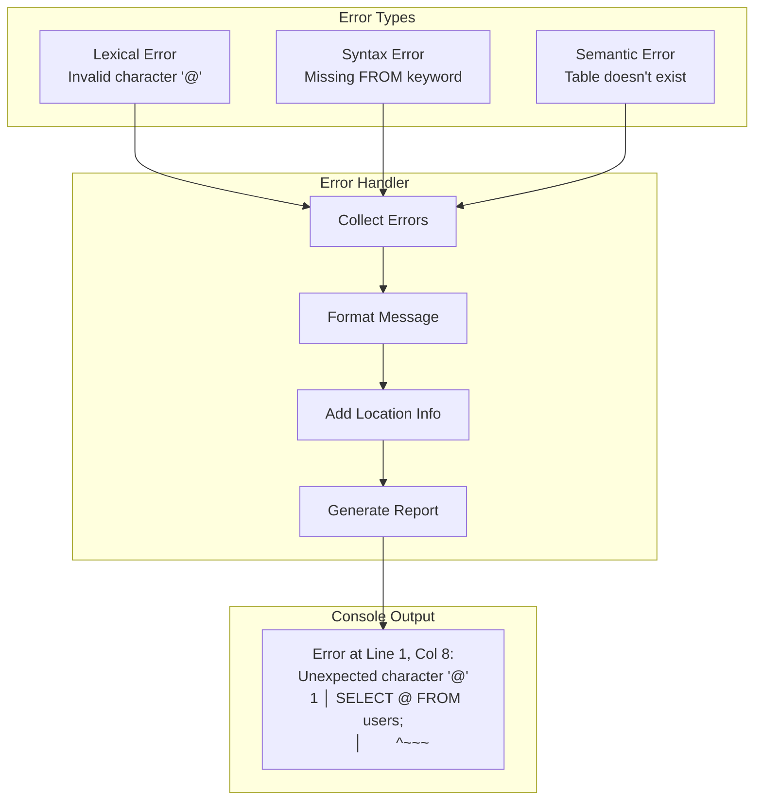

# Mini SQL Compiler - Flowchart & Problem Statement

## Problem Statement

Design and implement a **Mini SQL Compiler** that validates SQL SELECT queries by simulating the core phases of a compiler. The compiler should:

1. **Tokenize** SQL queries into meaningful tokens (keywords, identifiers, operators)
2. **Parse** the token stream to verify grammatical correctness
3. **Validate** semantic correctness (table/column existence)
4. **Report** meaningful errors with precise location information
5. **Generate** a Parse Tree as intermediate representation

**Scope:** The compiler validates queries without executing them on a real database.

**Supported SQL Subset:**
```sql
SELECT column1, column2, ... | *
FROM table_name
[WHERE column operator value]
;
```

---

## System Flowchart



---

## Detailed Phase Flow

### Phase 1: Lexical Analysis (Tokenization)



### Phase 2: Syntax Analysis (Parsing)



### Phase 3: Semantic Analysis



---

## Data Flow Diagram



---

## Error Handling Flow



---

## Summary

| Phase | Input | Output | Key Operation |
|-------|-------|--------|---------------|
| Lexical | Character stream | Token stream | Pattern matching |
| Syntax | Token stream | Parse tree | Recursive descent |
| Semantic | Parse tree | Validation result | Symbol table lookup |
| Output | All results | Final report | Error aggregation |
