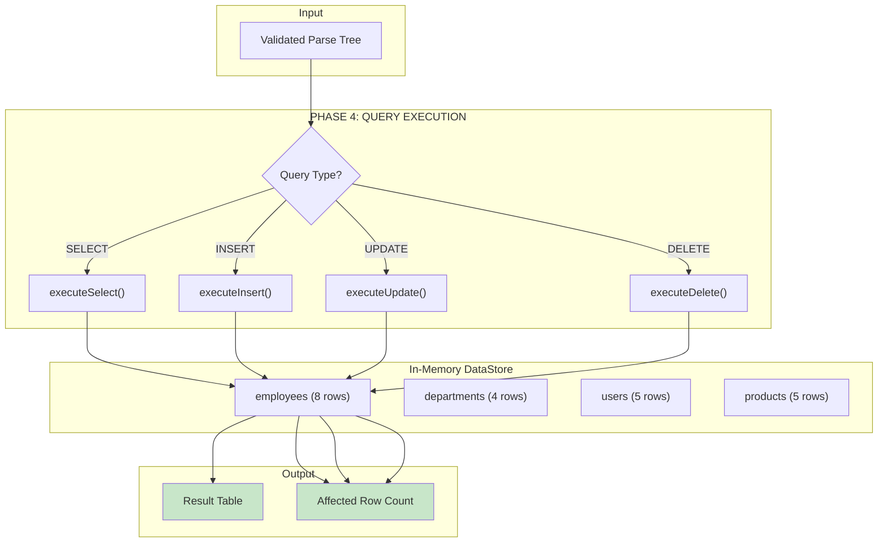
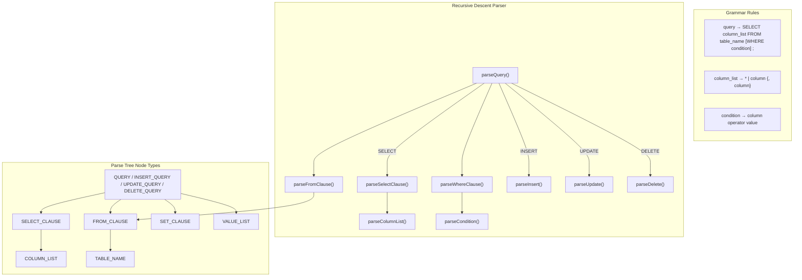
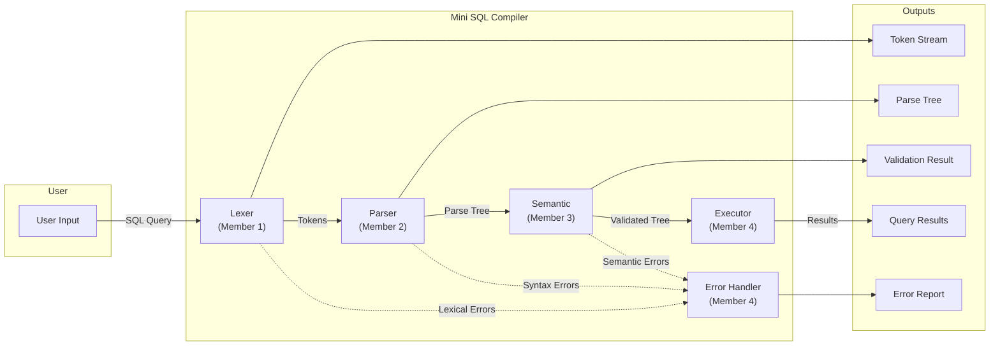

# Mini SQL Compiler - Flowchart & Problem Statement

## Problem Statement

Design and implement a **Mini SQL Compiler** that validates and executes SQL queries by simulating the core phases of a compiler. The compiler should:

1. **Tokenize** SQL queries into meaningful tokens (keywords, identifiers, operators)
2. **Parse** the token stream to verify grammatical correctness
3. **Validate** semantic correctness (table/column existence)
4. **Execute** validated queries against in-memory data store
5. **Report** meaningful errors with precise location information
6. **Generate** a Parse Tree as intermediate representation

**Supported SQL:**
```sql
SELECT col1, col2 | * FROM table [WHERE condition];
INSERT INTO table (col1, col2) VALUES (val1, val2);
UPDATE table SET col = value [WHERE condition];
DELETE FROM table [WHERE condition];
```

---

## System Flowchart


> **Note:** After Phase 3 (Semantic Analysis), the compiler now proceeds to **Phase 4 (Execution)**, which runs validated queries against the in-memory DataStore and returns actual results.

---

## Execution Phase Flow (Phase 4)



---

## Detailed Phase Flow

### Phase 1: Lexical Analysis (Tokenization)


### Phase 2: Syntax Analysis (Parsing)



### Phase 3: Semantic Analysis


---

## Data Flow Diagram



---

## Error Handling Flow


---

## Summary

| Phase | Input | Output | Key Operation |
|-------|-------|--------|---------------|
| Lexical | Character stream | Token stream | Pattern matching |
| Syntax | Token stream | Parse tree | Recursive descent |
| Semantic | Parse tree | Validation result | Symbol table lookup |
| Execution | Validated tree + DataStore | Query results | Data operations |
| Output | All results | Final report | Error aggregation |
